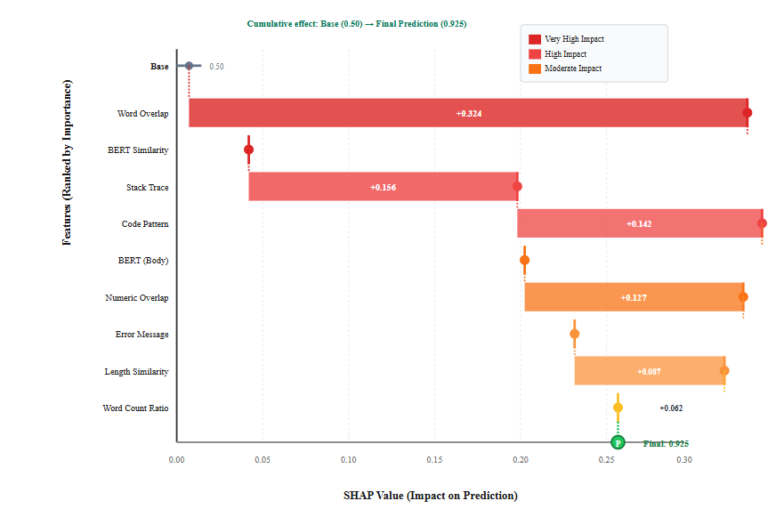
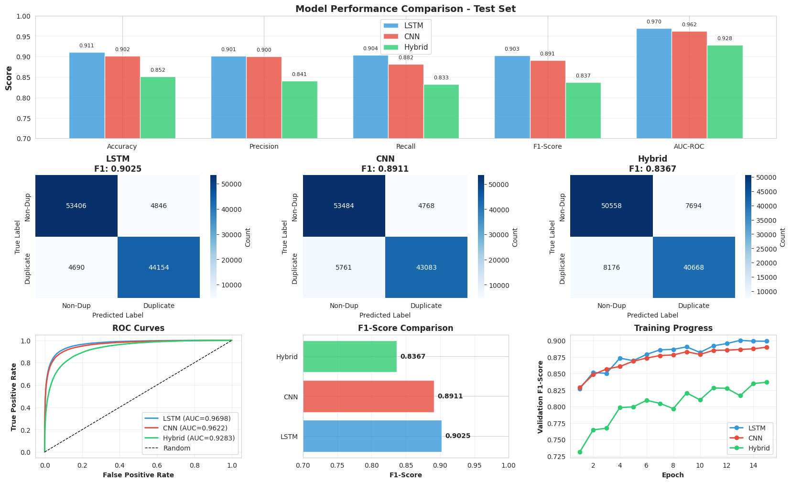

# Duplicate-Bug-Detection

# LSTM-CNN Architecture Enhanced with Semantic Metadata for Efficient Duplicate Bug Report Detection

## 📌 Overview

This repository contains the implementation and research work for the paper:

**“LSTM-CNN Architecture Enhanced with Semantic Metadata for Efficient Duplicate Bug Report Detection”**

The project focuses on improving automated duplicate bug report detection using a hybrid deep learning architecture combining:

* **LSTM** for contextual sequence learning
* **CNN** for local feature extraction
* **Semantic Metadata Features** for explicit similarity analysis
* **DistilBERT Embeddings** for contextual text representation

The proposed model achieved:

* ✅ **92.53% F1-Score**
* ✅ **93.13% Accuracy**
* ✅ Better performance than complex attention-based architectures
* ✅ Faster training and inference with lower computational cost

---

## 🧠 Research Highlights

### 🔹 Key Contributions

* Designed a **semantic metadata framework** with significantly stronger correlation than traditional metadata
* Compared **6 deep learning architectures** under identical conditions
* Demonstrated that **feature quality is more important than model complexity**
* Achieved strong cross-project generalization using over **535,000 bug report pairs**

---

## 🏗️ Proposed Architecture

The proposed architecture combines:

* DistilBERT contextual embeddings
* LSTM layers for sequential understanding
* CNN layers for pattern extraction
* Semantic metadata branch for explicit similarity detection


## 📊 Dataset

Dataset used:

* **MSR 2014 Duplicate Bug Report Dataset**
* Projects:

  * Eclipse
  * NetBeans
  * OpenOffice

### Dataset Statistics

| Statistic           | Value   |
| ------------------- | ------- |
| Total Bug Pairs     | 535,477 |
| Duplicate Pairs     | 267,739 |
| Non-Duplicate Pairs | 267,738 |
| Training Split      | 70%     |
| Validation Split    | 10%     |
| Test Split          | 20%     |

---

## ⚙️ Technologies Used

* Python
* TensorFlow / Keras
* DistilBERT
* Scikit-learn
* NumPy
* Pandas
* SHAP
* Google Colab

---

## 🧪 Semantic Metadata Features

The model uses 10 semantic metadata features including:

* Word overlap ratio
* Text length similarity
* Code pattern matching
* Error message similarity
* Stack trace presence
* Numeric content overlap
* Product/component matching
* Word count ratio
* Detail level indicators

These features significantly improved duplicate detection performance.

---

## 📷 Project Images

### Architecture Diagram

.png)

.png)


### Model Performance Comparison

%20(1).svg)

### SHAP Feature Importance



### Computational Efficiency




🔗 **Colab Notebook:**

[[Google Colab Link Here](https://colab.research.google.com/drive/1XWkq9G4Vf_Vh_RRf7bj6xLVOfYxiCA5A#scrollTo=8WeDkOFcNqQ1)](https://colab.research.google.com/)

---
## 🌐 IEEE Publication

🔗 **IEEE Publication Link:**

[[IEEE Publication Link Here](https://ieeexplore.ieee.org/document/11499933)]

## 📑 Research Paper


If you use this work, please cite:

```bibtex
@article{sandunika2026duplicatebugdetection,
  title={LSTM-CNN Architecture Enhanced with Semantic Metadata for Efficient Duplicate Bug Report Detection},
  author={Sandunika, D.M.N. and Herath, GACA and Kumara, B.T.G.S.},
  year={2026}
}
```

---

## 👩‍💻 Author

### D.M.N Sandunika

* Software Engineering Graduate
* QA Engineer
* Researcher in AI & Software Engineering

📧 Email: [dmnsandunika@std.appsc.sab.ac.lk](mailto:dmnsandunika@std.appsc.sab.ac.lk)

---

## 🙏 Acknowledgment

Special thanks to:

* Sabaragamuwa University of Sri Lanka
* MSR 2014 Dataset Contributors
* IEEE Research Community

---

## ⭐ Repository Goals

This project aims to:

* Improve automated software maintenance
* Reduce manual bug triaging effort
* Explore efficient deep learning architectures
* Demonstrate the value of semantic metadata in software engineering research

---
